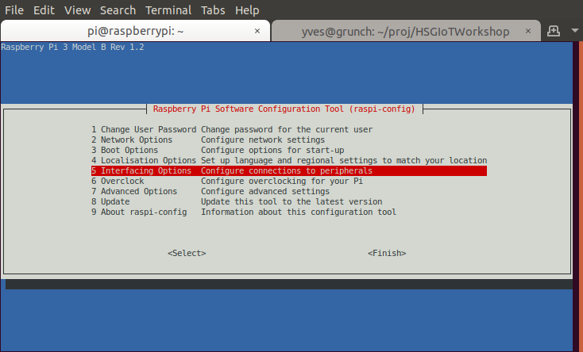
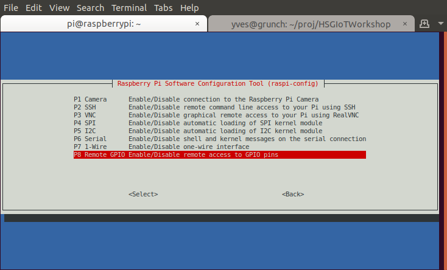

## Step 0: Setup Raspberry Pi

1. Connect the RPi to power, using a standard USB-micro cable.
   Note that this USB port does not serve any communication, it acts only as power connector.
2. Find the IP address of you RPi, it should be printed on a sticker.
   Set an environment variable to that address, so that you don't have to type it in every command.
   To do that, open a terminal on your laptop and enter
   ```
   nano ~/.bashrc
   ```
   This opens the file `.bashrc` in your home directory with the `nano` editor.
   Add the following line somewhere, be sure to replace `???` with the number of your RPi.
   ```
   export RPI=raspberry???.local
   ```
   Press `Ctrl-X` to exit the editor, and confirm saving by pressing `Y`.
   The file `.bashrc` is executed by the terminal application every time a new window is opened.
   To execute it now, type `source ~/.bashrc`.
   The line we have added will store the IP of your RPi in the _environment variable_ `RPI` for later use.
3. Log-in to your RPi using SSH. To that end, in an open terminal window on your laptop, type the following:
   ```
   ssh pi@$RPI
   ```
   It will ask for the password of the `pi` user, which defaults to `raspberry`.
   After that, you will be greeted by the Raspberry Pi on your terminal window.
   You are now in an interactive SSH session, meaning that all further commands and output are happening on the RPi.
4. Test that Python is properly installed by typing
   ```
   python3.6 --version
   ```
5. Ensure that the [pigpio](http://abyz.me.uk/rpi/pigpio/python.html) and
   [gpiozero](https://gpiozero.readthedocs.io/en/stable/)
   python libraries are installed by issuing the command
   ```
   pip3.6 install pigpio gpiozero
   ```
5. Still in the RPi SSH session, open the RPi configuration utility by typing
   ```
   sudo raspi-config
   ```
   A text-based GUI will open, where you can configure various settings of your RPi.

   

   Navigate to `Interfacing options`, and ensure that `SPI` and `Remote GPIO` are enabled (more on those later).

   

   Exit the configuration utility.
6. Enable the `pigpiod` daemon using the command
   ```
   sudo systemctl enable pigpiod
   ```
   A daemon is a program that continuously runs in the background (under MS Windows, it's called a Service).
   This daemon
7. Close the SSH connection by pressing `Ctrl-C` or typing `exit`. You will now be back in the bash session
   on your laptop, meaning all further commands will be processed there.

### Additional things to try
- Connect to the graphical interface running on the RPi using a VNC client.
  First, enable VNC in the RPi configuration utility (via a SSH session),
  then open a [RealVNC](https://www.realvnc.com/en/connect/download/vnc/) client on your laptop and connect to the IP of your RPi.
- Copy files from your laptop to the RPi using SCP: In a terminal on your laptop (not in an SSH session),
  type `scp SRC_FILE1 SRC_FILE2 ... pi@${RPI}:PATH_ON_RPI`