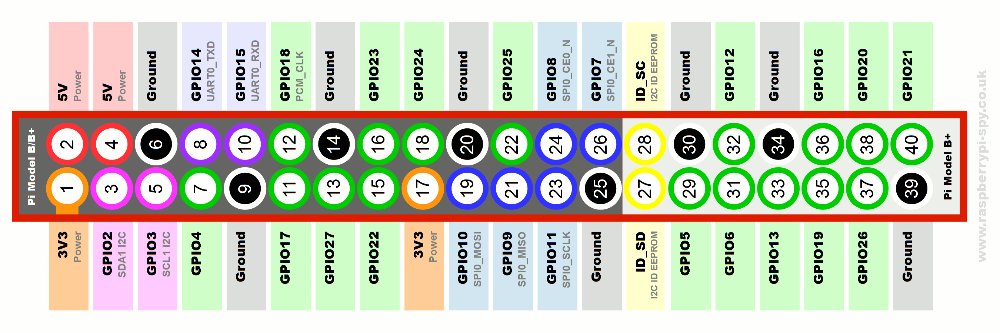

## Step 1: Button and LED

### Hardware

**Attention:** While the electroncis of the Raspberry Pi and the external
components are fairly robust, they can be destroyed through improper handling.
In particular, a short-circuit between any two of the supply pins
(`GND`,`3.3V` and `5V`) or between a supply-pin and a GPIO pin (when configured as output)
may result in destruction of the Raspberry Pi.
**It is good practice to disconnect the RPi from power when changing
the wiring. Always double-check before re-enabling power.**
Note that short-circuits can be indirect:
Through a wire, breadboard connections and or certain components:
In particular, both the _Button_ and the _LED_ may act as direct connection,
connecting them directly leads to a short and possible destruction of the component.
Resistors, as well as the piezo speaker are safe in that respect.




#### RGB LED


- Polarity matters (it simply won't light up when reversed)
- Ground is one of the two middle pins
- Connect a 220 Ohm resistor in series to limit current
- Do **not** connect without limiting resistors (LEDs will likely be damaged)
- You may use any GPIOs
- [`gpiozero.LED`](https://gpiozero.readthedocs.io/en/stable/api_output.html#led)
  provides very convenient abstractions for your python code

#### Button


- No actual pull-up resistor is required, as the Raspberry Pi already offers one.
- Don't forget to enable the pull-up resistor in software
- If it doesn't work, ensure that you use the right pair of pins (diagonal shouls always work)
- You may use any GPIO
- [`gpiozero.Button`](https://gpiozero.readthedocs.io/en/stable/api_input.html#button)
  provides good abstractions here. In particular, look at the following properties:
  - `when_pressed`
  - `when_released`
  - `when_held`

### Software
- You may start programming from the file `Step 1 - LED and Button.py`.
  Fill in all the missing parts.
- To control time in your program,
  [`time.monotonic`](https://docs.python.org/3.6/library/time.html#time.monotonic)
  and
  [`time.sleep`](https://docs.python.org/3.6/library/time.html#time.sleep)
  are very useful.
- To test your program, you may run it directly from your laptop.
  To make that work, you first need to install gpiozero and pipgio
  on your laptop:
  ```
  sudo pip3 install gpiozero pigpio
  ```
  Then, you need to tell the script where to find your RPi,
  which you can do using an
  [environment variable](https://gpiozero.readthedocs.io/en/stable/remote_gpio.html#environment-variables):
  You need to run the program as follows
  ```
  PIGPIO_ADDR=$RPI python3 your_script.py
  ```
  If it keeps complaing about being unable to create a default pin-factory,
  ensure that you have the correct address of your PI,
  and that the `pigpiod` daemon is running on the PI.
  If it isn't, execute `sudo service start pigpiod` within an SSH session again.
- When you run the script directly on the PI, the environment variable is not needed.
- For that, you may copy it either using SCP, or you may simply clone
  your GitHub repository fork directly from the PI (using SSH).


### Further things to try
- Compare how fast the code runs directly on the PI to how fast it runs
  remotely.
- Try using [remote GPIO](https://gpiozero.readthedocs.io/en/stable/recipes_remote_gpio.html)
  from an interactive Jupyter/IPython session on your laptop.
- Can you make complex blink and beep patterns?