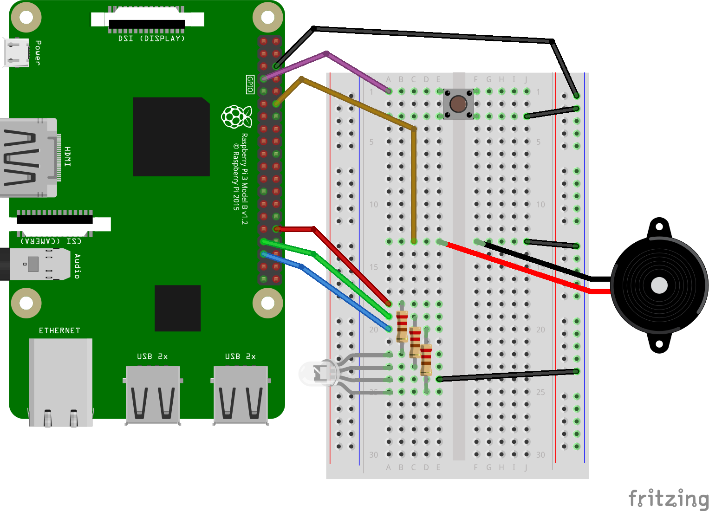

## Step 2: PWM and Piezo

### Hardware




#### RGB LED
- No change to the wiring is required.
- However, only pins 12, 13, 18 and 19 provide true hardware PWM,
  the others will emulate the PWM in the PGIO driver.
- [`gpiozero.PWMLED`](https://gpiozero.readthedocs.io/en/stable/api_output.html#pwmled)
  provides access to PWM.
- There is a dedicated RGB LED class which also provides PWM:
  [`gpiozero.RGBLED`](https://gpiozero.readthedocs.io/en/stable/api_output.html#rgbled).
  You will need to pass a triple `(r, g, b)` to set the colour of the LED.
- The values should be between 0 (completely off) and 1 (completely on).

#### Piezo
- Also here, only pins 12, 13, 18 and 19 provide true hardware PWM.
- There is no dedicated abstraction for our piezo transducer
  (`gpiozero.Buzzer` is for _active_ piezo buzzers).
  The more generic
  [`gpiozero.PWMOutputDevice`](https://gpiozero.readthedocs.io/en/stable/api_output.html#pwmoutputdevice)
  will have to suffice. Keep an eye out for the `frequency` parameter.
- Maximum loudness will be achieved at `value = 0.5` (do you see why?).

### Software
- You may start programming from the file `Step 2 - PWM LED, Button and Piezo.py`,
  or from your previous script from step 1.
- The new feature to implement this time is only switching of colours.
- Remember that the human eye can only perceive three truly independent
  colours (reg, green and blue); all other colours are mixtures of those three.
  The provided file `nightlight/colour_constants.py` provides constants
  with nammes matching the RGB triple. Import it via
  ```
  from nightlight import colour_constants as C
  ```
  such that you can write e.g. `C.GOLD1` (a fancy word for orange)
  instead of `(1.000, 0.843, 0.000)`.
- The provided template code makes use of a
  [`@property` decorator](https://stackabuse.com/python-properties/)
  to define a pair of getter and setter methods


### Further things to try
- If the piezo speaker is not hearble, try frequencies in the range 1 kHz to 10 kHz.
- Make the LED change the colour smoothly (through linear interpolation of the RGB values)
- Change the brightness of the LED by multiplying all three colour components
  with the same value.
- Try to play a tune with the piezo speaker by changing the frequency dynamically.

