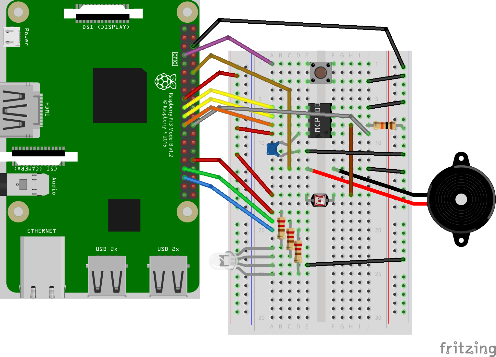
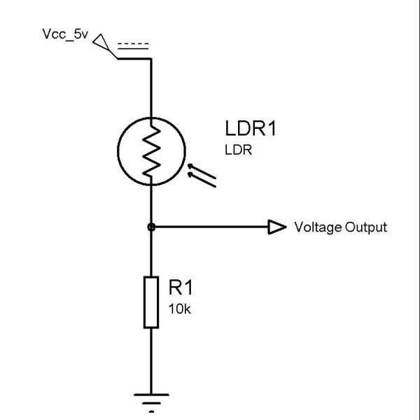
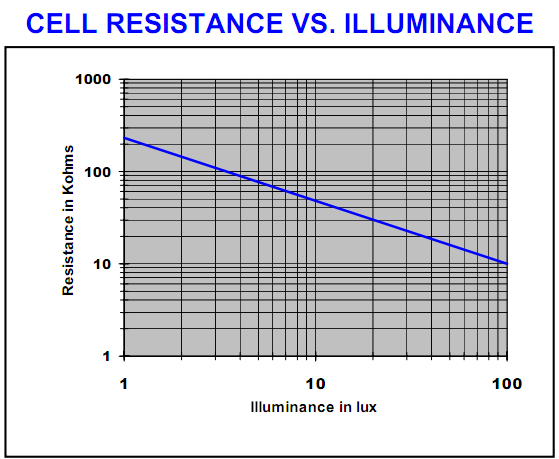
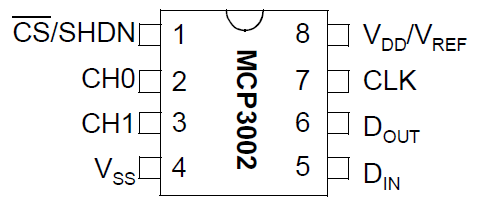

## Step 3: Sensors

### Hardware

#### Light-dependent resistor

- Build a voltage divider with LDR and a standard resistor.
  Connect it to 3.3 V, not 5 V as shown in the picture.
- A resistor value between 10 kOhm and 100 kOhm is suitable,
  depending on the ambient light-levels of interest.
  The darker, the bigger resistors are needed.
- Neither the LDR nor the resistor have a meaningful orientation.
  You can place them either way.
- The divided voltage is the signal to be measured,
  it needs to be connected to the ADC.

#### ADC (MCP 3002)

- **Attention:** Integrated circuits (ICs) are somewhat sensitive to
  electrostatic discharges. Try not to touch the pins of the IC while handling it.
- Also, pay attention to the notch at the end - orientation matters.
  Swapping it's orientation and switching power on will likely damage the IC.
- This IC needs 7 connections to work:
  - Vdd: Positive power supply - connects to 3.3V.
  - Vss: Negative power supply - connects to GND.
  - CLK: SPI clock line - connects to SPI SCLK (GPIO 11) on RPi.
  - DI: SPI data in - connects to SPI MOSI (master-out, slave-in, GPIO 10) on RPi.
  - DO: SPI data out - connects to SPI MISO (master-in, slave-out, GPIO 9) on RPi.
  - CS: chip select - connects to SPI CE0 (chip-enable 0, GPIO 8) or SPI CE1 (chip-enable 1, CPIO 7) on RPi.
  - CH0/CH1: Analog input channels - at least one needs to connect to LDR voltage divider.
- There is special support for this ADC in
  [`gpiozero.MCP3002`](https://gpiozero.readthedocs.io/en/stable/api_spi.html?highlight=MCP3002#gpiozero.MCP3002).
  Be sure to select the correct `channel` (CH0/CH1, where the LDR is connected)
  and the correct `chip` (chip-enable CE0 or CE1) in the constructor.
  `port` should be zero. Set `differential=False`.
- While the raw ADC readings are in the range 0..1023, `gpiozero`
  rescales those values into the range 0..1 .

### Software
- There are quite a few new feature requests this time.
  The provided `Step 3 - Full functionality.py` provides already some structure.
- You may of course also first play around with the ADC via an interactive IPython/Jupyter notebook.
- The goals of this step are to complete the following night-light features:
    - The following parameters are configurable:
      - Colour of the light when on
      - Brightness of the light when on
      - Threshold: The ambient brightness level at which the light switches on (in normal mode)
    - The _mode_ can be cycled with the button between _off/normal/always on_
    - Mode and configuration changes trigger a notification pattern, including sound
    - A button press-hold resets the threshold to the current ambient brightness
- Because press-hold is now reserved for threshold reset, it cannot be
  used to quit the application. Just press `Ctrl-C` on your keyboard instead.

### Troubleshooting
- If the ADC value gets lower at higher light intensities,
  either the voltage divider is swapped or `differential=True`.

### Further things to try
- Try to come up with user-interaction patterns with that single button we have
  to let users select colour, brightness and/or threshold.
- Replace the resistor of the voltage divider with one of a different value.
- Did you note that the night-light starts to randomly blink when the
  threshold is close to the current ambient light brightness?
  Can you guess why that is the case?
- How could you prevent that random blinking from happening?

