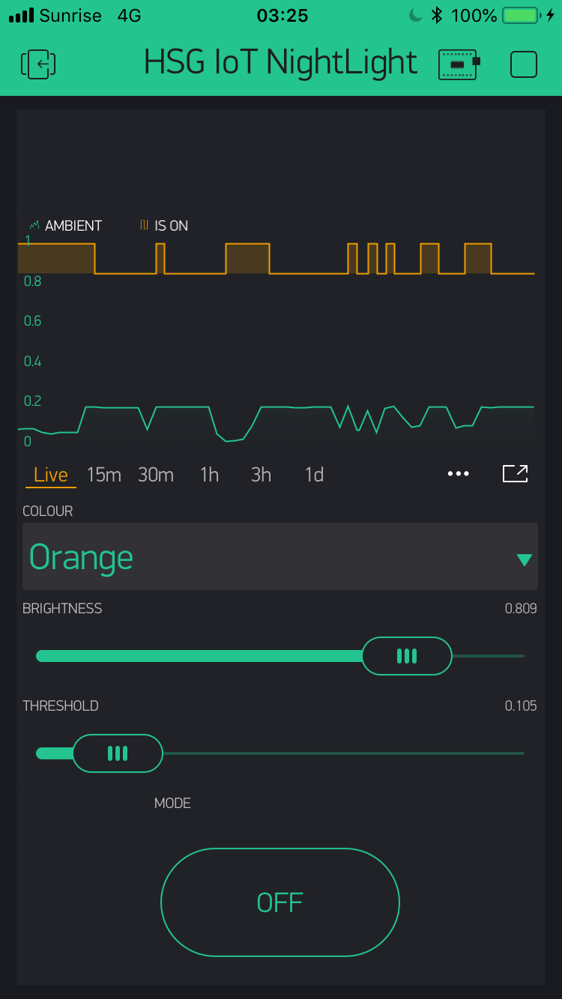
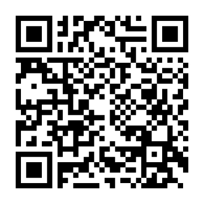

## Step 4: Cloud connection

Note that this part of the workshop makes use of [Blynk](https://www.blynk.cc/),
a commercial IoT platform that started from Kickstarter.
While it is one of many such IoT platforms, there are very few open-source ones.
Among the platforms I found, it's the only one that is both easy to use,
and offers mobile-app rapid prototyping.
The app itself is free, but it only allows a limited number of controls
and indicators at the same time. For our night-light it's just enough.



### Blynk App
- Download the [Blynk App](https://www.blynk.cc/) on your mobile phone
- Create a new account in the Blynk App.
- In the Blynk App project overview find the QR-scanner icon
  and scan the code below to get a clone of my Blynk project
  to get you started.
  
- Otherwise, you can also create a new project from scratch.
- Be sure to adjust the value ranges of both indicators and controls
  to the correct range.
- Select a suitable virtual pin for each control and indicator.
  Note that the python interface only supports virtual pins.


### Raspberry Pi / Laptop
- Install the Blynk python library using
  ```
  sudo pip3 install blynk-library-python
  ```
- You may base your code on the provided `Step 4 - Connectd.py`.
- Advertise the presence of your Raspberry Pi to the cloud
  using `blynk = BlynkLib.Blynk(BLYNK_AUTH)`,
  where `BLYNK_AUTH` is the API code you received by mail.
  You will also find the auth code in the project information within
  the app.
- To receive data from the app in the Raspberry Pi, decorate
  the event-handler functions with `@blynk.VIRTUAL_WRITE(num)`,
  where `num` is the virtual pin number.
  The decorated function will receive the virtual pin value as first
  argument, as a string. Use `float()` or `int()` to convert it to a number.
- To send data from the Raspberry Pi to the app, simply call
  `blynk.virtual_write(num, value)`, where `num` is again the
  pin number, and `value` is the value to write to that pin.
- If a task needs to be run repeatedly, register the task function
  with `blynk.set_user_task(task_func, 1000)`.
- Once all is setup, hand control to the blynk run function using
  `blynk.run()`.
- More information can be found in the [Blynk API docs](http://docs.blynk.cc/).


### Further things to try
- Try out different ways how to control your night-light
  and to display it's state in the app.
- Try to update the [UI properties](http://docs.blynk.cc/#blynk-main-operations-change-widget-properties)
  in turn with changes on the night-light, e.g. match the UI colour with the currently selected light colour.
- Advanced: Use the [pin history function](https://blynkapi.docs.apiary.io/#reference/0/pin-history-data/get-all-history-data-for-specific-pin)
  of the REST API to display the ambient brightness history
  in a IPython/Jupyter notebook.
- Advanced: Exchange an Auth token with a neighbour and use the
  [REST API](https://blynkapi.docs.apiary.io/#reference) to do
  Machine-2-Machine communication.
